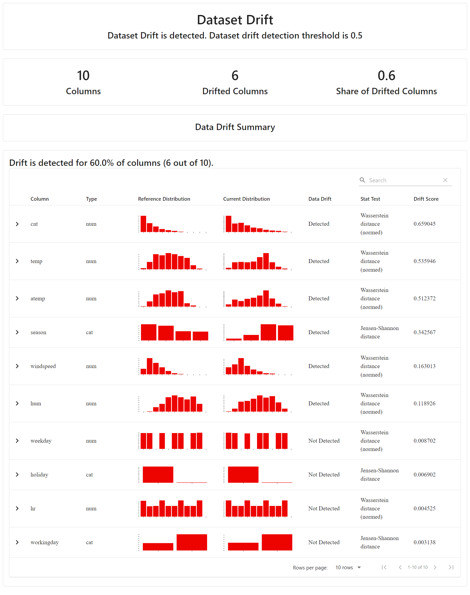
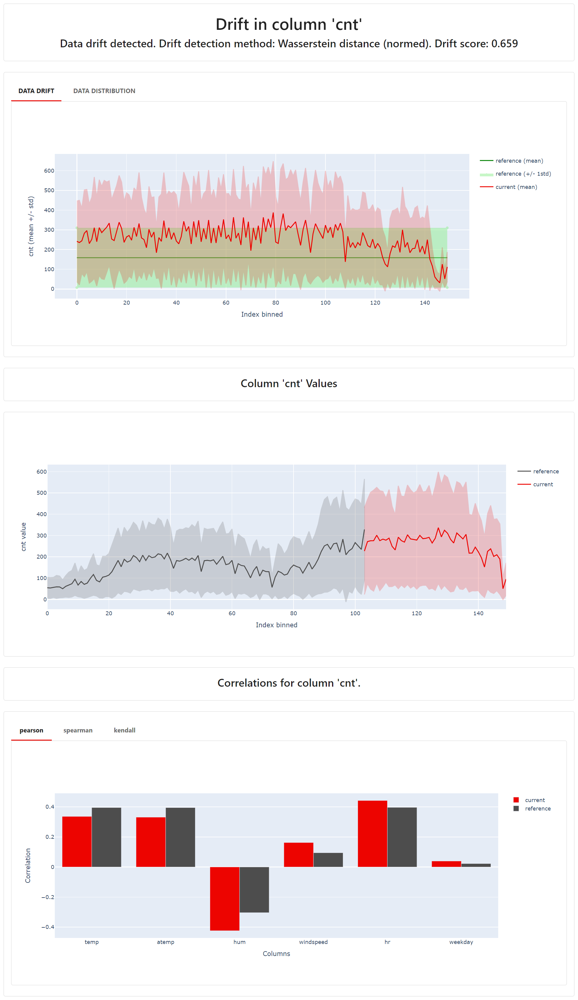

# 


# Model Monitoring and Drift Detection
In many real-world applications, machine learning models are trained offline and deployed for inference in production environments. Over time, changes in the underlying data can lead to model performance degradation. One critical issue that signals the need for model retraining is the occurrence of data drift—a change in the distribution of input features compared to the original training data.
This repository contains two Python scripts for monitoring model performance, detecting data drift, and identifying new classes in the target variable for classification problems.

## Statistical Tests for Drift Detection
The monitoring process relies on several well-established statistical tests to detect drift and monitor model performance. These tests are automatically selected based on the characteristics of the dataset. Evidently AI employs a set of five key statistical tests for this purpose:

- 1. **Population Stability Index (PSI)**: Measures changes in the distribution of a feature over time. It's widely used for monitoring data drift in production.

- 2. **KS P-Value (Kolmogorov-Smirnov Test)**: Compares the distributions of the input feature in the training and production datasets.

- 3. **Jensen-Shannon Divergence (JSD)**: A symmetric measure used to assess how different two probability distributions are.

- 4. **Kullback-Leibler Divergence (KL Divergence)**: A non-symmetric measure of how one probability distribution diverges from a second, reference distribution.

- 5. **Wasserstein Distance**: Also known as the "Earth Mover's Distance," it calculates the minimum amount of work needed to transform one distribution into another.

## Scripts

### 1. `monitoring.py`

This Python script monitors model performance and data drift between a reference dataset (e.g., training data) and a current dataset (e.g., data in production) for classification problems. It generates reports for data drift, target drift, and statistical metrics for numerical features, and stores results along with metadata in both JSON and Excel formats.

### 2. `monitoring_new_class.py`

This Python script detects the presence of new classes in the target variable of a current dataset compared to a reference dataset (e.g., training data) for classification problems. It generates reports highlighting newly detected classes and stores the results along with metadata in both JSON and Excel formats.


## Features
- **Metadata Generation**: Captures event metadata such as the timestamp, record count, source system, user, and model version.
- **Data Drift Report**: Automatically generates a data drift report comparing reference and current datasets.
- **Target Drift Report**: Monitors drift in target labels between datasets.
- **Statistical Summary**: Computes statistics (mean, standard deviation, variance) for numerical features across both datasets.
- **Report Storage**: Saves the final results in JSON and Excel formats for easy sharing and analysis.

## Prerequisites

Before running the script, ensure you have the following installed:

- Python 3.x
- Required packages (install with the command below):

```bash

pip install pandas evidently openpyxl
 ```

## How to Run

1. **Prepare the Data**: Ensure you have your reference and current datasets loaded in CSV format. The script compares these datasets.

2. **Define Column Mappings**: Set the numerical and categorical features, target, and prediction column names in the script.

3. **Run the Script**: You can run the script directly from the command line or in a Python environment. Make sure to update paths for your data files if needed.

    ```bash
    python monitoring.py
    ```

4. **Results**: The script will generate:
   - A data drift report (`data_drift_report.html`)
   - A target drift report (`target_drift_report.html`)
   - A JSON file with metadata, drift metrics, and statistics (`monitoring_results.json`)
   - An Excel file summarizing the results (`monitoring_results.xlsx`)
  
## Output Report Files

- **Data Drift Report**:
    

- **Target Drift Report**:
    

- **`monitoring_results.json`**: Contains the final JSON output with metadata, drift results, and statistical summary.
- **`monitoring_results.xlsx`**: Excel file containing metadata, data drift, target drift, and feature statistics.

### Notes:
- Replace `monintoring.py` with the actual name of your script.
- Update the `usage example` section if there are additional parameters or specifics for data loading.
     
### References:
- https://www.evidentlyai.com/ml-in-production/concept-drift
- https://github.com/evidentlyai/evidently/tree/main/examples/how_to_questions
